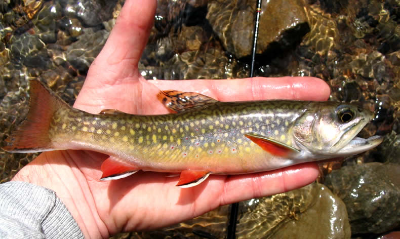

# Connecticut Cold Water Mapping Application

**Mapping Application:** https://ctdeepwatermonitoring.github.io/ColdWaterHab/

*leaflet 1.5.1 JQuery 3.2.1 esri-leaflet 2.3.0*

**Data Sources:** CT DEEP Water Quality Monitoring and Assessment and Inland Fisheries Programs

**Data Processing:**  *QGIS 3.4.10-Madeira on Ubuntu 18.04 and R version 3.6.2*

## Summary

The map displays cold water sites and supporting habitat.  Cold water habitat was determined using available fish and water temperature data collected by the CT DEEP Monitoring and Assessment and Inland Fisheries Programs.  The analysis to date includes years 1988 - 2019.  The mapping application will be updated with new or updated information as it is collected and analyzed.  Additional information on the project can be found on a soon on the [CT DEEP Monitoring and Assessment website](https://portal.ct.gov/DEEP/Water/Inland-Water-Monitoring/Water-Quality-Monitoring-Program).

